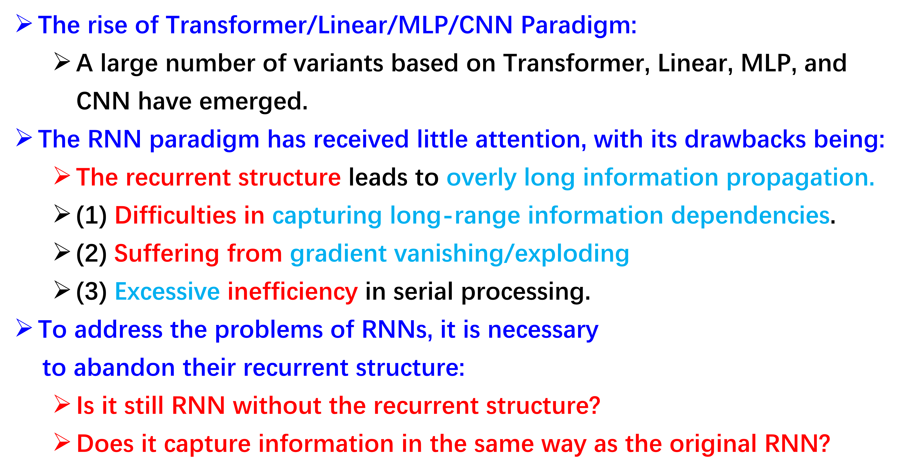
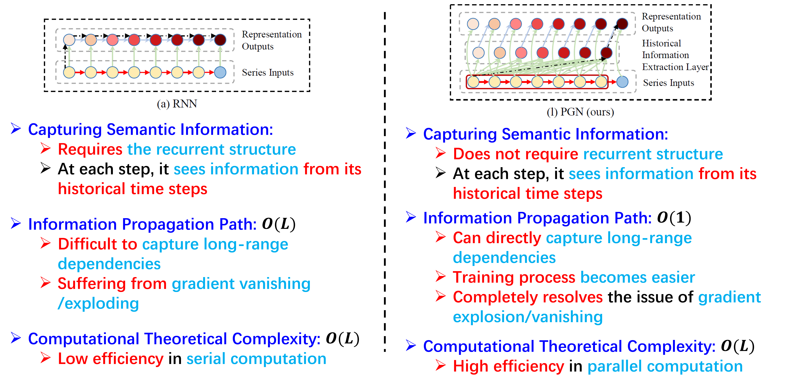
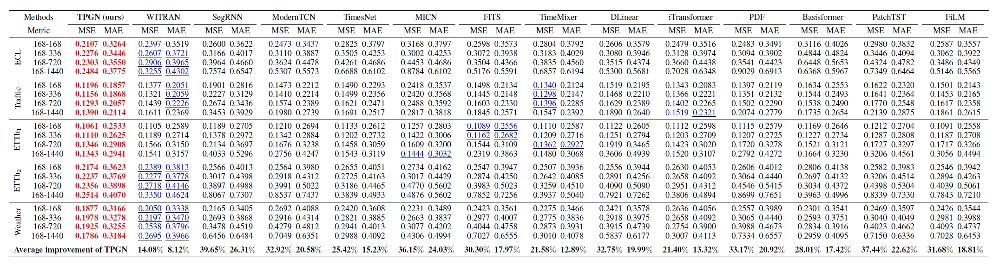
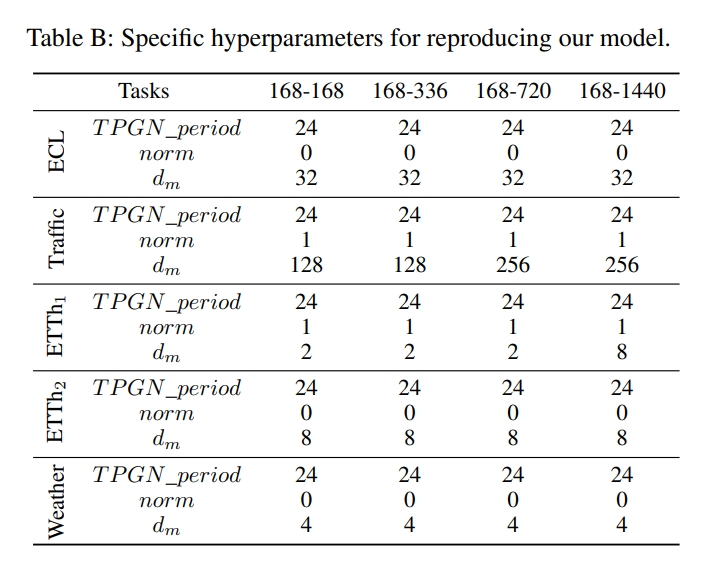

# (NeurIPS 2024) PGN: The RNN's New Successor is Effective for Long-Range Time Series Forecasting

🚩 Our paper, titled **PGN: The RNN's New Successor is Effective for Long-Range Time Series Forecasting**, has been accepted at **NeurIPS 2024**! The final version can be found at: [[PGN](https://openreview.net/forum?id=ypEamFKu2O)]. 

# Our Poster


## Related Work




## PGN & TPGN


(1) We propose a novel general paradigm called PGN as the new successor to RNN. It reduces the information propagation path to $\mathcal{O}(1)$, enabling better capture of long-term dependencies in input signals and addressing the limitations of RNNs.

(2) We propose TPGN, a novel temporal modeling framework based on PGN, which comprehensively captures semantic information through two branches. One branch utilizes PGN to capture long-term periodic patterns and preserve their local characteristics, while the other branch employs patches to capture short-term information and aggregates them to obtain a global representation of the series. Notably, TPGN can also accommodate other models, making it be a general temporal modeling framework. 

(3) In terms of efficiency, PGN maintains the same complexity of $\mathcal{O}(L)$ as RNN. However, due to its parallelizable calculations, PGN achieves higher actual efficiency. On the other hand, TPGN, serving as a general temporal modeling framework, exhibits a favorable complexity of $\mathcal{O}(\sqrt{L})$.


## PGN & RNN



## Experiments

To fairly compare the performance of each model, we set up the search space so that each model can perform optimally on each task. 

Here is the baseline we have chosen:

(1) WITRAN (NeurIPS 2023)(**RNN-based**),

(2) SegRNN (Arxiv)(**RNN-based**),

(3) ModernTCN (ICLR 2024)(**CNN-Based**), 

(4) TimesNet (ICLR 2023)(**CNN-Based**), 

(5) MICN (ICLR 2023)(**CNN-Based**),

(6) FITS (ICLR 2024)(**Linear-Based**), 

(7) TimeMixer (ICLR 2024)(**MLP-Based**), 

(8) DLinear (AAAI 2023)(**Linear-Based**), 

(9) iTransformer (ICLR 2024)(**Transformer-Based**), 

(10) PDF (ICLR 2024)(**Transformer-Based**), 

(11) Basisformer (NeurIPS 2023)(**Transformer-Based**), 

(12) PatchTST (ICLR 2023)(**Transformer-Based**), 

(13) FiLM (NeurIPS 2022),

(14) and earlier methods such as Vanilla-Transformer (NeurIPS 2017), Informer (AAAI 2021), Autoformer (NeurIPS 2021), Pyraformer (ICLR 2022), and FEDformer (ICML 2023) have been extensively surpassed by the methods we selected above. Hence, we did not include these earlier methods as baselines in our comparison.



We have presented the specific hyperparameters of our model for different tasks across all datasets in follow Table, facilitating the direct reproducibility of our experimental results.

**It should be noted that differences in the experimental environment will interfere with the experimental results, so in practical situations, parameter search work should be conducted based on specific task requirements. The parameter details we disclose corresponding to the experimental results on our experimental platform.**



## Get Start of TPGN

1. Install Python>=3.9, PyTorch 1.10.1.
2. Download data. You can obtain all the benchmark datastes from [[Autoformer](https://github.com/thuml/Autoformer)] or [[Informer](https://github.com/zhouhaoyi/Informer2020)].
3. Train the model. Please change the default dataset and parameters in `run.py` and execute it with the following command:

```bash
python run.py
```

## Reference

Thank you for your interest in our paper. The citation format is as follows:

```
@inproceedings{
jia2024pgn,
title={{PGN}: The {RNN}'s New Successor is Effective for Long-Range Time Series Forecasting},
author={Yuxin Jia and Youfang Lin and Jing Yu and Shuo Wang and Tianhao Liu and Huaiyu Wan},
booktitle={The Thirty-eighth Annual Conference on Neural Information Processing Systems},
year={2024},
url={https://openreview.net/forum?id=ypEamFKu2O}
}
```
